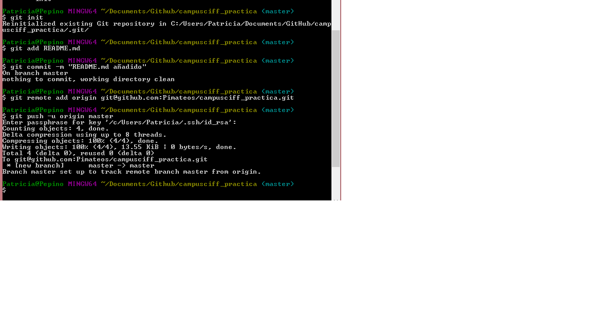
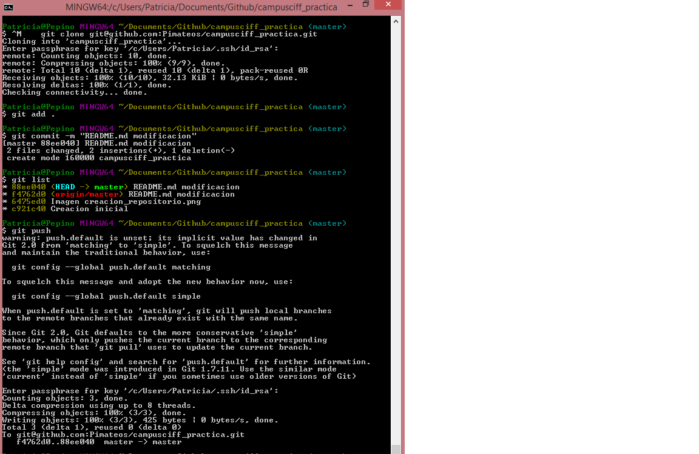
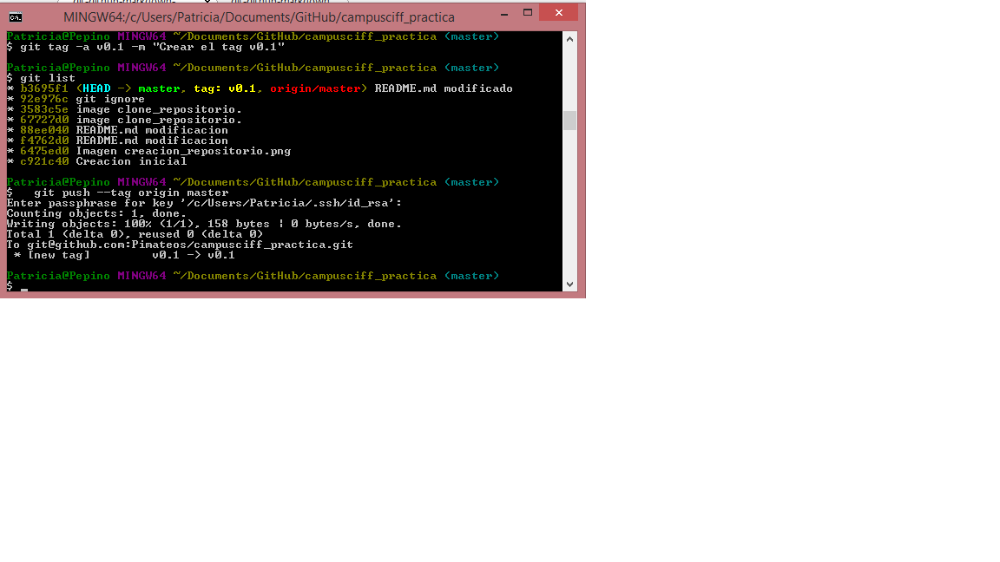
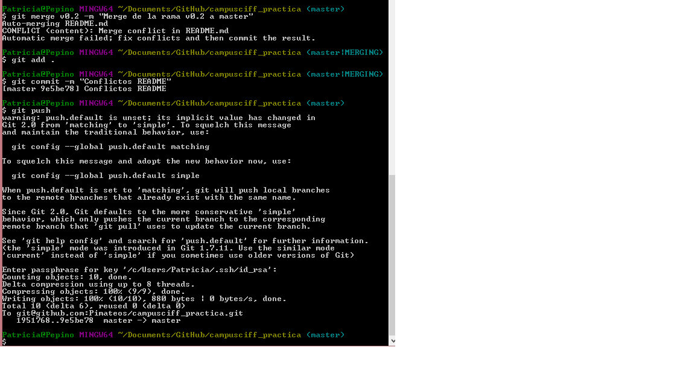
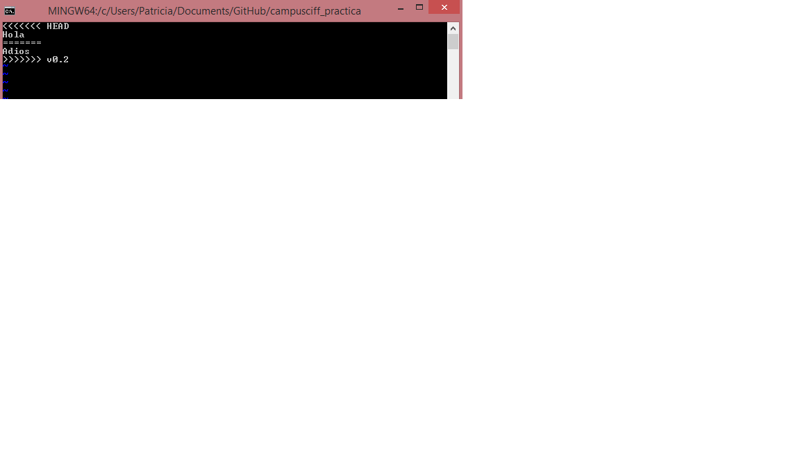
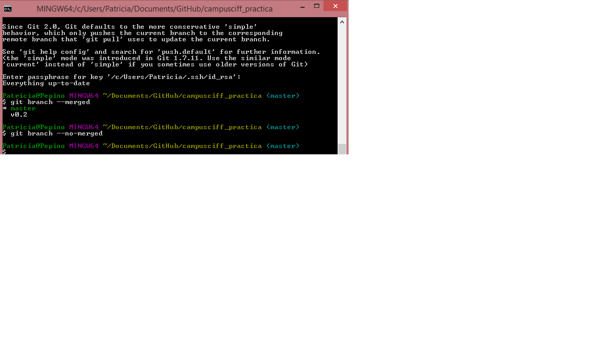

# Ejercios GitHub 
## Patricia Iglesias Mateos

## 2.1 REPOSITORIO
**1. Crear un repositorio en vuestro GitHub llamado campusciff**
    git config --global user.email "pimateos@yahoo.com"
    git config --global user.name "pimateos"
    mkdir campusciff_practica
    cd campusciff_practica
    git init

##2.2 REPOSITORIO CAMPUSCIFF(II)
**2. Clonar vuestro repositorio en local**

    git clone git@github.com:Pimateos/campusciff_practica.git

##2.3 README
**3.Crear (si no lo habéis creado ya) en vuestro
repositorio local un documento README.md.**
> Notas: en este documento tendreís
que ir poniendo los comandos que
habéis tenido que utilizar durante
todos los ejercicios y las
explicaciones y capturas de
pantalla que consideréis
necesarias.

##2.4 COMMIT INICIAL
**1.Añadir al README.md los comandos utilizados hasta ahora y hacer un commit inicial con el mensaje commit inicial**

Ver imagen inicial

##2.5 PUSH INICIAL
**1.Subir los cambios al repositorio remoto**

Ver los pasos anteriores

##2.6 IGNORAR ARCHIVOS(I)
**1.Crear en el repositorio local un fichero llamado privado.txt**

    touch privado.txt
**2.Crear en el repositorio local una carpeta llamada privada**
    mkdir privada

##2.7 IGNORAR ARCHIVOS(II)
**1.Realizar los cambios oportunos para que tanto el archivo como la carpeta sean ignorados por git**

    vi .gitignore

He añadido privado.txt y privada en otra linea
Despues he sincronizado y no aparecen.

##2.8 AÑADIR FICHERO 1.TXT
**1.Añadir fichero 1.txt al repositorio local**

    touch 1.txt
    git add .
	git commit -m "1.txt añadido"
	git push

##2.9 CREAR EL TAG V0.1
**1.Crear un tag v0.1**

    git tag -a v0.1 -m "Crear el tag v0.1"

##2.10 SUBIR EL TAG V0.1
**1.Subir los cambios al repositorio remoto**

    git push --tag origin master

##2.11 CREAR UNA RAMA V0.2
**1.Crear una rama v0.2**

    git branch v0.2
**2.Posiciona tu carpeta de trabajo en esta rama.**  
  
    git checkout v0.2

##2.12 AÑADIR FICHERO 2.TXT
**1.Añadir un fichero 2.txt en la rama v0.2**

    touch 2.txt

##1.13 CREAR RAMA REMOTA V0.2
>>>>>>> v0.2
**1.Subir los cambios al repositorio remoto**
    git add .
    git commit -m "2.txt añadido"
	git push

##2.14 MERGE DIRECTO
**1.Posicionarse en la rama master**
   ` git checkout master`

**2.Hacer un merge de la rama v0.2 en la rama master**
    `git merge v0.2 -m "Merge de la rama v0.2 a master"`

##2.15 MERGE CON CONFLICTO(I)
**1.En la rama master poner Hola en el fichero 1.txt y hacer commit**

    vi 1.txt
	git add .
	git commit -m '1.txt Hola'

**2.Posicionarse en la rama v0.2 y poner Adios en el fichero "1.txt" y hacer commit**

        git checkout v0.2
    	vi 1.txt
    	git add .
    	git commit -m '1.txt Adios'
    
    
##2.17 MERGE CON CONFLICTO(III)
**1.Posicionarse de nuevo en la rama master y hacer un merge con la rama v0.2**

    git checkout master
    git merge v0.2 -m "Merge conflicto v0.2"
   

##2.18 LISTAR LAS RAMAS CON MERGE Y SIN MERGE

    git branch --merged
	git branch --no-merged

##2.19 ARREGLAR CONFLICTO
**1.Arreglar conflicto anterior y hacer commit**

    vi 1.txt
    git add .
    git commit -m '1.txt conflictos arreglados'
  	git push

#2.20 BORRAR RAMA
**1.Crear un tag v0.2**
    `git tag -a v2.0 -m "Etiqueta añadida tag v2.0"  fd3da87`

**2.Borrar la rama v0.2**

        git branch -d v0.2
    
#2.21 LISTADO DE CAMBIOS
**1.Listar los distintos commits con sus ramas y sus tags**

    git log --decorate

##2.22 CUENTA DE GITHUB
**1.Poner una foto en vuestro perfil de GitHub**

**2.Poner el doble factor de autenticacion en vuestra cuenta de GitHub**

**3.Añadir(si no lo habeis hecho ya)la clave publica**

